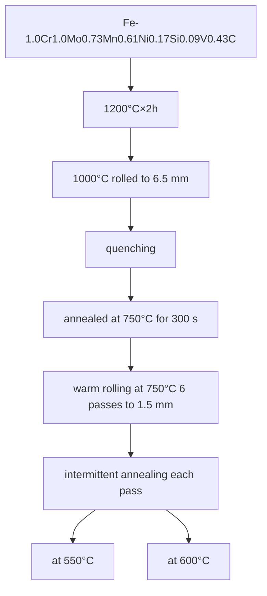
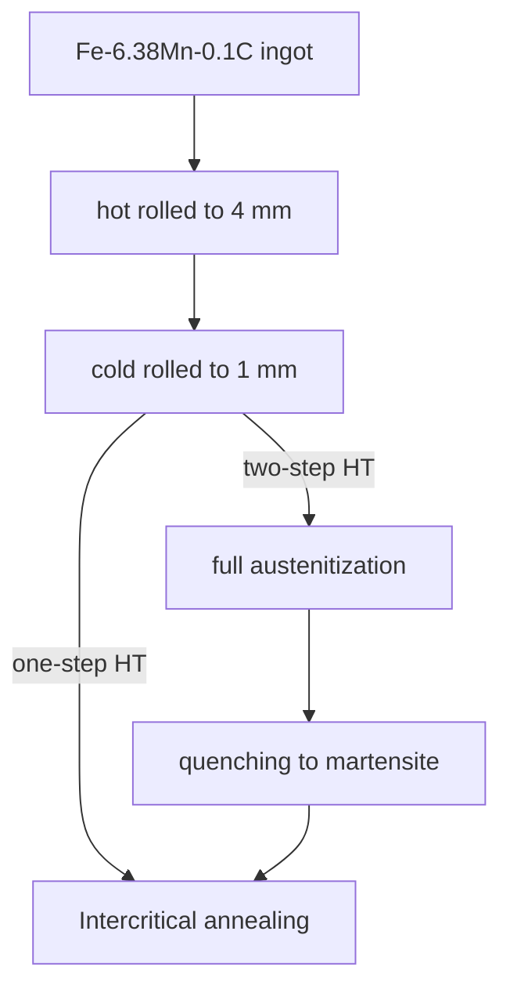
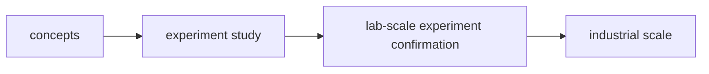
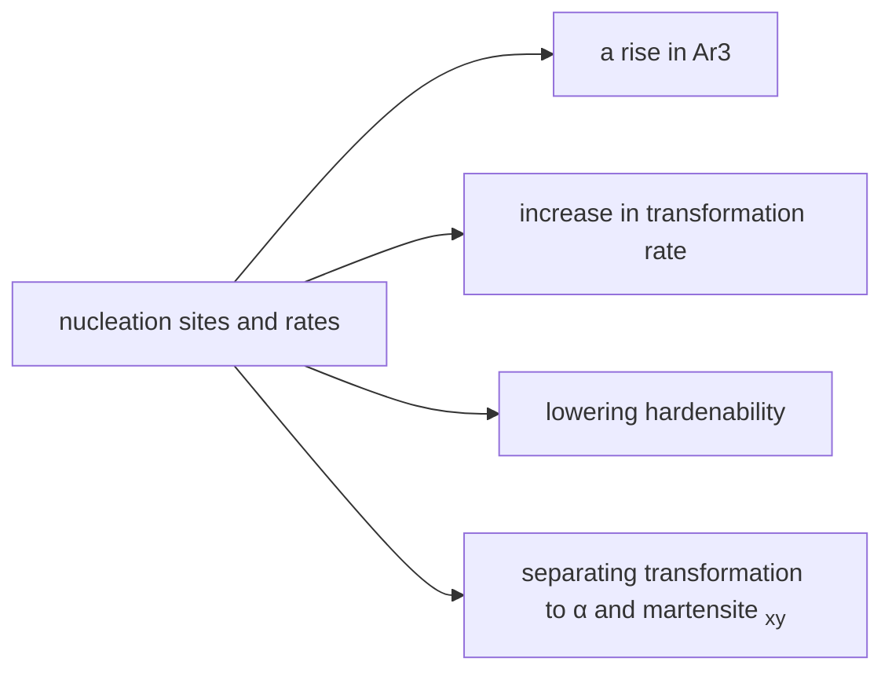

## Literature note on ultrafine-grained ferrite (UFF) steels

Shibata et al.[@shibata2019a]:

Using *in-situ* neutron diffraction, Shibata *et al.* proposed that dynamic recrystallization of dynamically-transformed (DT) ferrite, which occurs in a diffusional manner, whose partitioning behavior changes from para- to ortho-equilibrium with the progress of transformation, is the main mechanism for the formation of ultrafine-grained structure. 

Nagai _et al._ [@nagai2005] : There are two approaches to obtain UFF structure in steels.

- Recrystallization route: heavy deformation at low temperature is necessary for the ultra refinement.

- transformation route: making high density of ferrite initiation sites in the deformed austentie, especially of the heavily compressed austenite structures, and further hindering the ferrite growth is also inevitable to utilize the high initiation rate.

  

  ## Advantages of ultra-refinement

  - Improve strength and toughness dramatically
  - Excellent fatigue property
  - the poor uniform elongation can be enhanced by the design of the second phase dispersion.

## National projects

[1] NAGAI K. Ultrafine grained steels: basic research and attempts for application[J]. Canadian Metallurgical Quarterly, 2005, 44(2): 187–194.

# 

Title: Nanoscale spheroidized cementite induced ultrahigh strength-ductility combination in innovatively processed ultrafine-grained low alloy medium-carbon steel

N. Jia, Y. F. Shen, J. W. Liang, X. W. Feng, H. B. Wang, R. D. K. Misra

*Scientific Reports* **volume 7**

### Purpose

1. To improve ductility of HSLA steel through refining cementite to nanoscale and ferrite grains to ultrafine scale using a novel process. 
2. To study the quantitative effect of nanoscale Fe~3~C particles on mechanical properties.

### Advantages:

1. provide a  novel process to get ultrafine grained ferrite and nanoscaled cementite.
2. 

## 2019/9/10

### On the microstructural characteristics influencing the yielding behavior of ultra-fine grained medium-Mn steels

https://doi.org/10.1016/j.actamat.2017.07.056

L$\mathrm{\ddot{u}}$ders bands

### 2. Experimental

The chemical composition of the investigated medium-Mn steel was Fe-6.38Mn-0.1C(wt%). An 80 kg steel ingot was cast under laboratory conditions in a frequency medium farnace.  Subsequent to casting 

The carbon content for retained austenite was calculated using Eq.($\ref{eq1}$), where the lattice parameter of the retained austenite, $a_\gamma$ was obtained from the (200), (220) and (331) diffraction peaks.
$$
\mathrm{C(wt-\%)}=(\alpha_\gamma(\AA)-3.578-0.00095\times \rm{Mn}(wt-\%))/0.033 \label{eq1}
$$

For the study of the microstructural development, the quantification of the martensite fraction was necessary. Therefore, five SEM images in adjusted magnification for each selected HT condition were used. A grid (20 × 20 domains) was applied to the SEM images and the intersections with the respective phase were counted concluding in a phase fraction in area-%. The characterization of the austenitic phase by determination of the grain size, represented as an equivalent circle diameter (ECD) (Eq. [(2)](https://www.sciencedirect.com/science/article/pii/S1359645417306377#fd2)), and the evaluation of the morphology, expressed by the circularity (Eq. [(3)](https://www.sciencedirect.com/science/article/pii/S1359645417306377#fd3)), was performed with the software ImageJ using the particle analyzing feature.
$$
\rm ECD=(4A_y/\pi)^{0.5}
$$

$$
\rm Circularity=4\pi A_y/P_y^2
$$

here *A~y~* is the area and *P~y~* is the perimeter of the respective phase. 

The work hardening behavior was characterized by computing the incremental n-value $n_i$ (Eq. ($\ref{eq4}$)) for eqch HT condition.
$$
n_i=(dln\sigma/dln \varepsilon)-(\sigma/E) \label{eq4}
$$

$$
I=\varepsilon_{E}\delta_{B}\Tau \label{ref1}
$$
This is a reference: $\ref{ref1}$

**Considère instability criterion**  Consid$\rm{\grave{e}}$re

To study the work hardening behavior further, the incremental n-value $n_i$ was plotted as a function of true strain $\varepsilon_{true}$. The **Considère instability criterion**[^ref1], which is represented by the solid line, $n_i=\varepsilon_{true}$ [^2]was incorporated in the diagram to represent the relation between the work hardening behavior and the achieved UE. 

Due to the high hardness gradients in the material geometrically necessary dislocations were required and contributed to the work hardening [[42\]](https://www.sciencedirect.com/science/article/pii/S1359645417306377#bib42). For a better comparability of the results, the kinetics of strain-induced [martensitic transformation](https://www.sciencedirect.com/topics/physics-and-astronomy/martensitic-transformation) were described using the approach of D. C. Ludwigson and J. A. Berger [[43\]](https://www.sciencedirect.com/science/article/pii/S1359645417306377#bib43).

(7)*V**γ*−1−*V**γ0*−1 = *k**p* *p*−1 *ε*p

Roadmap of gradient ultra-fine grained steel plate. 

## Thermomechanical Processing of High-Strength Low-Alloy Steels--book

### Deformation of austenite in the nonrecrystallization region

#### 4.1 Retardation of recrystallization of $\gamma$

Because of the relation between austenite ($\gamma$) and ferrite ($\alpha$) grain sizes, the refinement of $\alpha$ grain structure is achieved mainly through that of $\gamma$ grain structure. Though $\alpha$ grain size decreases with the decrease in $\gamma$ grain size, the former reaches a limiting value of ~ 10 µm and cannot attain further decrease when an $\gamma$ grain size becomes about 10 µm, as shown in Figure 4.1, i.e. there is a limit in attaining $\alpha$-grain refinement through $\gamma\to\alpha$ transformation when $\alpha$ is produced from recrystallized, strain-free $\gamma$. However, a limiting $\alpha$ grain size can be broken by the transformation from deformed $\gamma$ to $\alpha$. The controlled -rolling makes full use of the beneficial effect of deformed $\gamma$ on $\alpha$ grain refinement. The controlled-rolling has been shown to consist of three stages: (1) deformation in the $\gamma$-recrystallization region; (2) deformation in the nonrecrystallization region; and (3) deformation in the ($\gamma+\alpha$) two-phase region.

## Reference

[^ref1]: Armand Considère, *Annales des Ponts et Chaussées* 9 (1885) pages 574-775
[^2]: The criterion for necking is therefore that the incremental increase in internal stress is exactly equal to the incremental decrease in the cross sectional area where the stress is localized. Courtney, Thomas H. (2000). Mechanical behavior of materials (2nd ed.), Boston: McGraw Hill.

-----

2019/9/25

### Deformation of austenite in the nonrecrystallization region

The $\alpha$ grain size correlates with effective $\gamma$ interfacial area $S_v$ (grain boundary area plus deformation bands). Ouchi *et al.*, in the early stage of transformation the transformation rate is given by $N_s\times S_v$ , where $N_s$ is the nucleation rate per unit boundary area. 再结晶奥氏体只提高有效界面积，非再结晶区变形奥氏体同时提高形核率与有效界面积（变形奥氏体晶界+变形带）。变形奥氏体晶界具有更高的能量，铁素体形核率更高。扩散型相变受到形核界面长大机制控制，在非再结晶区奥氏体变形。

热轧和正火钢中的奥氏体晶粒尺寸与铁素体晶粒尺寸比例随着奥氏体晶粒尺寸细化而降低，但极限值约为1。但是非再结晶区大压下轧制，比例可达到2.3～2.5。当经过再结晶细化的奥氏体经过非再结晶区压下达到70-80%，铁素体晶粒尺寸可细化到ASTM 12级，而正火钢只能达到约10级。

奥氏体非再结晶区变形，形成变形带与奥氏体晶界一样为铁素体相变提供了相变位置，相当于一个奥氏体晶粒被变形带分隔成几个区块。常规热轧和控制轧制比较，类似于正火和淬火。除了淬火，只有控制轧制可以分隔奥氏体晶粒。

奥氏体变形带对控制轧制极为重要，但其自然属性仍未清楚。Inagaki, Umemoto, Tamura，Otsuka是最早研究变形带自然属性的。Inagaki认为变形带实际是奥氏体的退火孪晶。

#### 4.3 Strain-induced and/or strain-enhanced transformation P93

应变诱导 *A*~r3~ 提高，可以用texture intensity来准确确定（Tanaka 和 Tabata），可用于任何控制轧制条件。

# References
